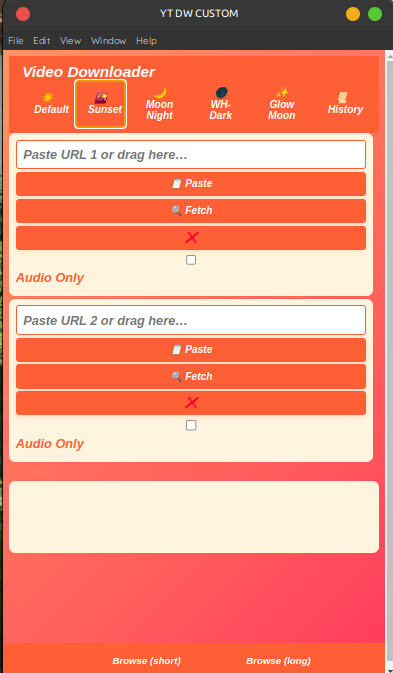
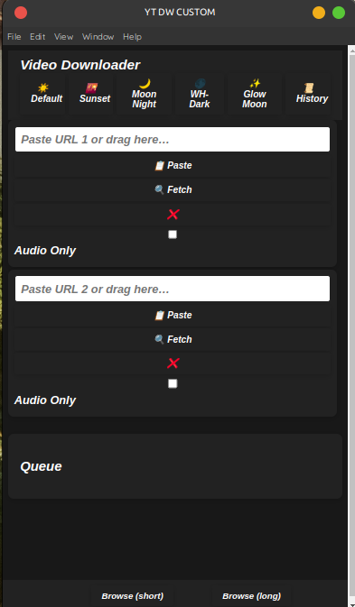
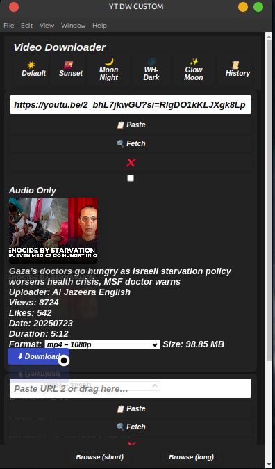

# yt-dlp-gui

A modern, multi-theme Electron YouTube downloader for Linux (with `.deb` packaging support).  
Based on Electron and Node.js as backend.

---

## Features

- **4 Download Boxes** for parallel downloads
- **Theme Switcher:**
  - Default
  - Sunset
  - Moon Night
  - WH-Dark (all dark except text)
  - Glow Moon Night (glowing accent)
- **Download Queue:**
  - Shows progress, speed, and status
  - Pause, resume, and cancel downloads
  - Auto-clears finished downloads after a few seconds (configurable)
- **Audio-Only Option:**  
  Checkbox in each box for easy audio extraction
- **Download History:**  
  View all previous downloads in a modal
- **Fast, Multi-Connection Downloads**
- **Auto-Selects Download Location by Video Length**
- **Custom Download Folder:**
  - Folder path display and "Browse" button (bottom left)
  - Remembers your choice
- **Drag-and-Drop Support** for URLs
- **Notifications** on download complete
- **More Video Info:**  
  Duration, resolution, uploader, views, likes, date, etc.
- **Modern, Responsive UI:**  
  Styled queue, history modal, progress bar, and drag-and-drop

---

## Screenshots

<p align="center">
  
  
  
</p>

---

## How to Run

```bash
npm install
npm start
